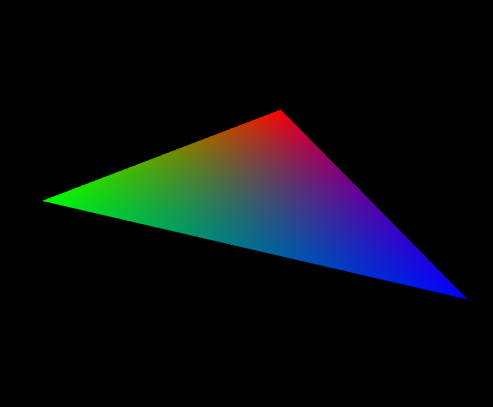
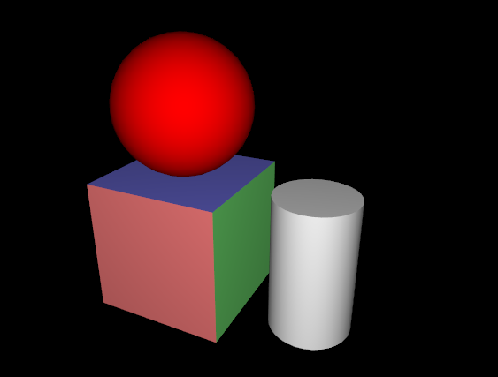

# Aardvark.Rendering Examples

## 01 - SimpleTriangle

This example illustrates very basic usage of Aardvark's `Sg` and renders a simple triangle using vertex-colors.

## 02 - Shaders

Implements basic FShade shaders, illustrates composition and `Sg` integration.

## 03 - Adaptive

Shows basic use of adaptive values in the `Sg` and very simple animations

